# Table of Contents
This is a guide on making the perfect bugout backpack for camping or any emergency situation. 

1.  [Todo](#todo)
2.  [Organizational Tools](#organization-tools)
3.  [Backpack Selection](#backpack-and-storage)
4.  [Front Compartment](#front-compartment)
5.  [Right Outer Compartment](#right-outer-compartment)
6.  [Left Outer Compartment](#left-outer-compartment)
7.  [Main Back Compartment](#main-back-compartment)
8.  [Main Front Compartment](#main-front-compartment)
9.  [Top Compartment](#top-compartment)
10. [Right Inner Slot](#right-inner-slot)
11. [Left Inner Slot](#left-inner-slot)

# Todo
- [ ] Add bedding, tent, or hammock packing (mount points on backpack)

# Organizational Tools
Throughout this guide I will use a combination of items to organize and protect the e    quipment on the list.  This includes:
- Twist Ties
- Plastic Bendy Twist Ties
- Soft cases
- Soft containers
- Shopping bags
- Ziplock bags
- Garbage bags
- Silica Packs (To keep moisture sensitive items dry)

# Backpack Selection
The core component is the selection of the best backpack. The best choice in backpack is something with hip support and buckles, multiple large pockets, and does not "stand out" when wearing (not tactical, military, Hello Kitty, neon colors, etc...

For this guide, I have chosen the [Kelty Redwing 44 Tactical in Forest Green](https://tinyurl.com/25w883pa)

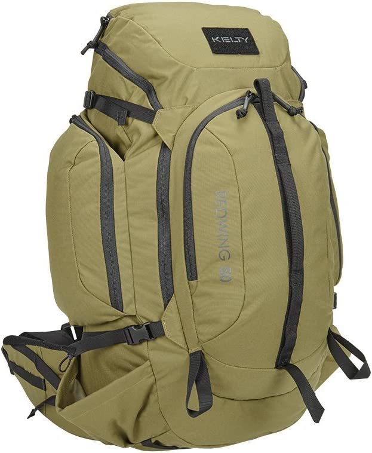

The guide will be broken up into each compartment of the backpack.  Adjust the list or groups based upon your selected packpack (If you don't go with the Kelty 44)

# Front Compartment
The front compartment consists of important items that are easily accessible when the pack is closed up

## Item List
- Mechanical Pencils (2)
- Ballpoint Pens (2)
- Silver Marker (1)
- Screw Driver Pen (1)
- Mechanical Pen Lead
- [Waterproof Playing Cards](https://tinyurl.com/2zfhwtxk)
- [Vondior Portable Radio with NOAA](https://tinyurl.com/425xb49n)
- [CR2032 Battery Charger](https://tinyurl.com/4a6znkfe)
- [CR2032 Rechargable Batteries](https://tinyurl.com/3kwrbnzf)
- USB-C to USB-C Cables (2)
- USB-C to USB-A Adapters (2)
- USB-C to lightning Cable
- USB-C Thumb Drive (I prefer 128GB or higher)
- USB-C Car Charger
- [45watt USB-C Wall Charger](https://tinyurl.com/394vtcv5)
- Micro SD Cards (2)
- Cheap AUX Earbuds (2)
- [Panasonic Charger with Eneloop Pro Batteries](https://tinyurl.com/2ejffpbp)
- Lens Cloth Wipe
- Knife Sharpener
- [Gerber Gear Suspension-NXT Multi-Tool](https://tinyurl.com/54sad2sy)

## Item Pictures
Individual Items:
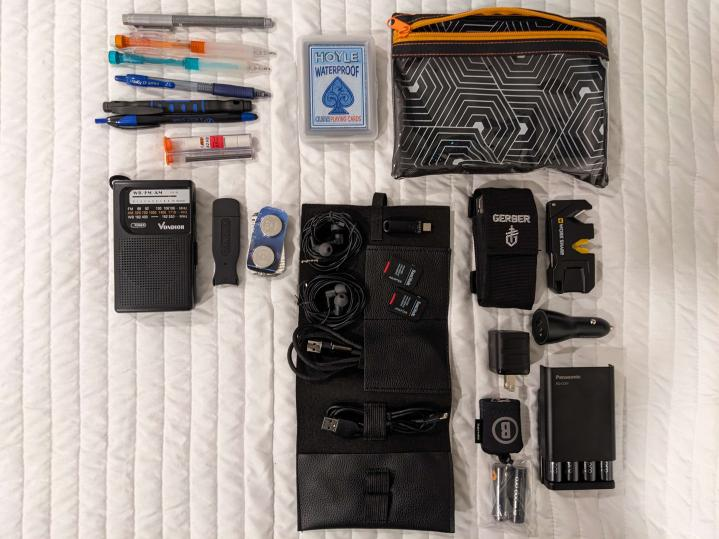

Items pack in containers or bags:
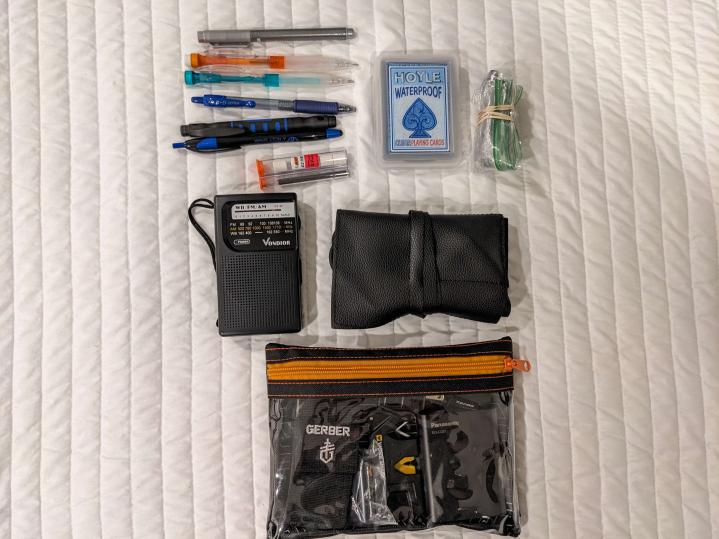

Items pack into the packpack:
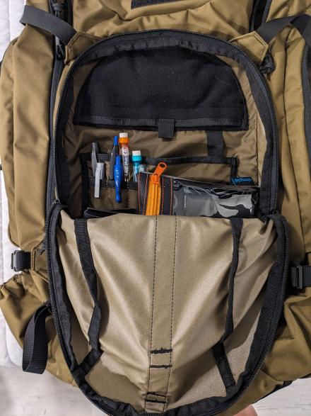

**NOTE**: The front area is packed to allow for easy access. To maximize the volume carries, this section could be filled with additional soft items like toilet paper or packaged [food](#food-selections).

# Right Outer Compartment
The Right compartment consists of the zippered section on the outer right side.

## Item List
- Duct Tape
- 1 Yard Patch Cloth
- Canvas #14 Needle
- Normal Sewing Needle
- Flat Magnet (for Needle Storage)
- Zip Ties
- Wet Wipe Packs (2)
- Toilet Papper Packs (2)
- Emergency Blanket
- [Paracord](https://tinyurl.com/3hxw3xah)

## Item Pictures
Individual Items:
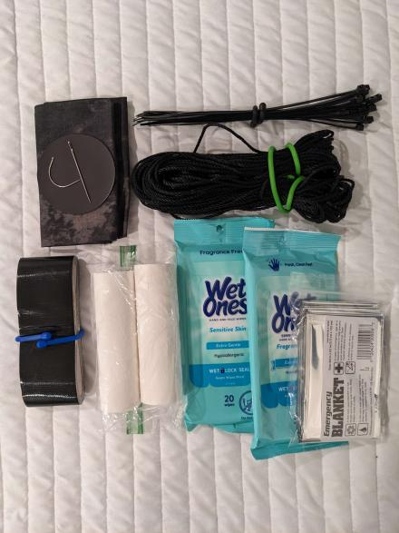

Items packed into the backpack:
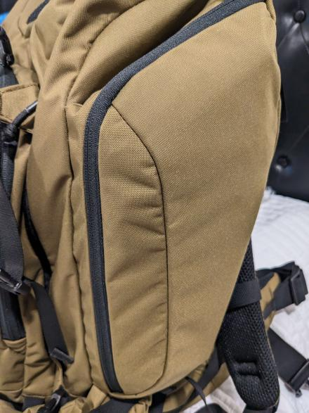

# Left Outer Compartment
The Left compartment consists of the zippered section on the outer left side. This side will not be stuffed as full due to the placement of the water bottle in the [left inner slot](#Left-Inner-Slot) later on.

## Item List
- Sawyer Filter Cleaning Syringe
- Spare Plastic Bags (3)
- Rain Poncho

## Item Pictures
Individual Items:
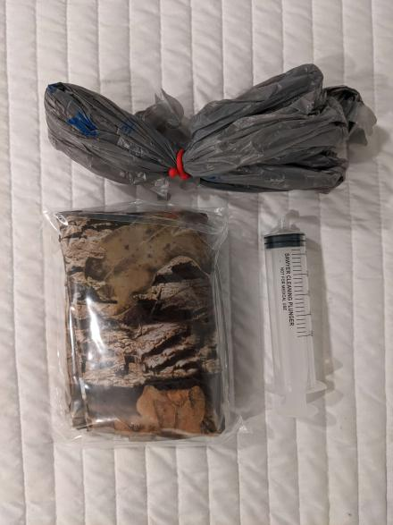

Items packed into the backpack:
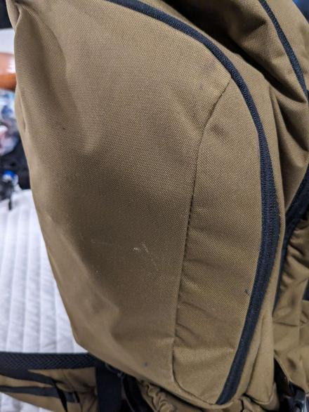

# Main Back Compartment
The main back compartment is useful for storing flat items that are not fragile

## Item List
- Sawyer Filter Bladders (2)
- Fast Dry Towel
- Mini Plastic Cutting Board
- [Lixada Camping Wood Stove](https://tinyurl.com/2jce2vh7)

## Item Pictures
Individual Items:
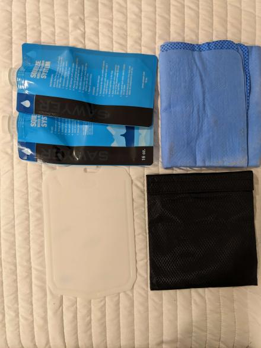

Items packed into the backpack:
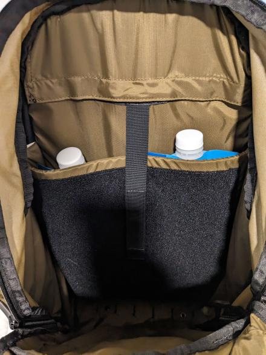

# Main Front Compartment
The main front compartment is the single largest space. I use the medium terry towel and
lay it at the bottom of the compartment to help protect the bottom of the backpack from any
type of puncture damage

## Item List
- [Ryno Tuff Solar Panels](https://tinyurl.com/h69tk2pe)
- Portable Battery Charger (Ideally one of large capacity and USB-A/C ports)
- [Vortex Solo Monocular](https://tinyurl.com/48tutfmt)
- [Marble Arms .22 Storage](https://tinyurl.com/288yyfdv)
- [Portable Gun Cleaning Kit](https://tinyurl.com/3z52wt88)
- White Terry/Hand Towel
- [Glock eTool](https://tinyurl.com/yw9uf36x)
- [SKEMEX Pocket Reel](https://tinyurl.com/2n4chw4p)
- [Kelty Rain Cover](https://tinyurl.com/mv482wjx)
- [Onn 7" Android Tablet](https://tinyurl.com/yvwmfee7) - Tablet setup is covered [here]()
- Rand McNally Maps - Maps for home and surrounding states
- Medical Kit - Combination of store supplies and better one-off medical items
- [Titanium Spork](https://tinyurl.com/3nf9c6ua)
- [Stanley Adventure Camp Cook Set](https://tinyurl.com/2p8dkmsn)
- [Ozark Trail Stainless Steel Cup](https://tinyurl.com/4hw9rku9)
- Thumb Plastic Thimble
- Heavy Duty Sewing Thread
- Bic Lighters (2)
- Steel Magnesium Fire Starter
- Small Can Openers (2)

## Item Pictures
Individual Items:
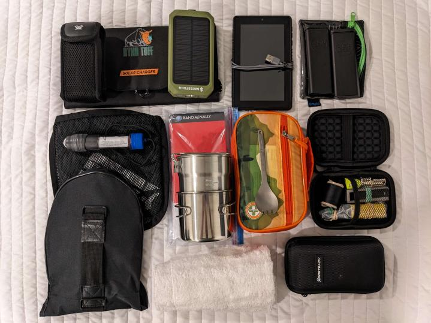

Items packed into the backpack:
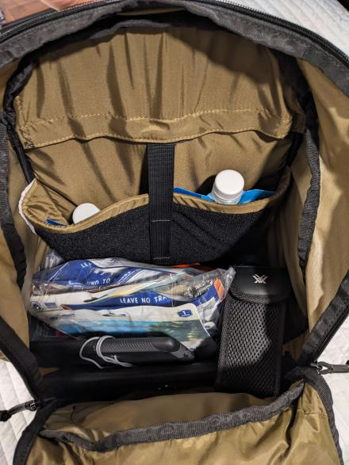

**NOTE**: The main compartment can be further filled to max capacity with either soft items (like
toilet paper) or additional sealed [food](#food-selections) supplies

# Top Compartment

## Item List

## Item Pictures
Individual Items:

Items packed into the backpack:

# Right Inner Slot

## Item List

## Item Pictures
Individual Items:

Items packed into the backpack:

# Left Inner Slot

## Item List

## Item Pictures
Individual Items:

Items packed into the backpack:

# Food Selections
Below is a list of food that can be purchased that have a long shelf life, condensed, and have the highest calorie count

## Item List
- MRE's
- Backpacker's Pantry (Walmart, REI, Academy Sports)

## Item Pictures
Sealed Meals:
~[Screenshot of sealed full meals](pictures/food_1.jpg)
